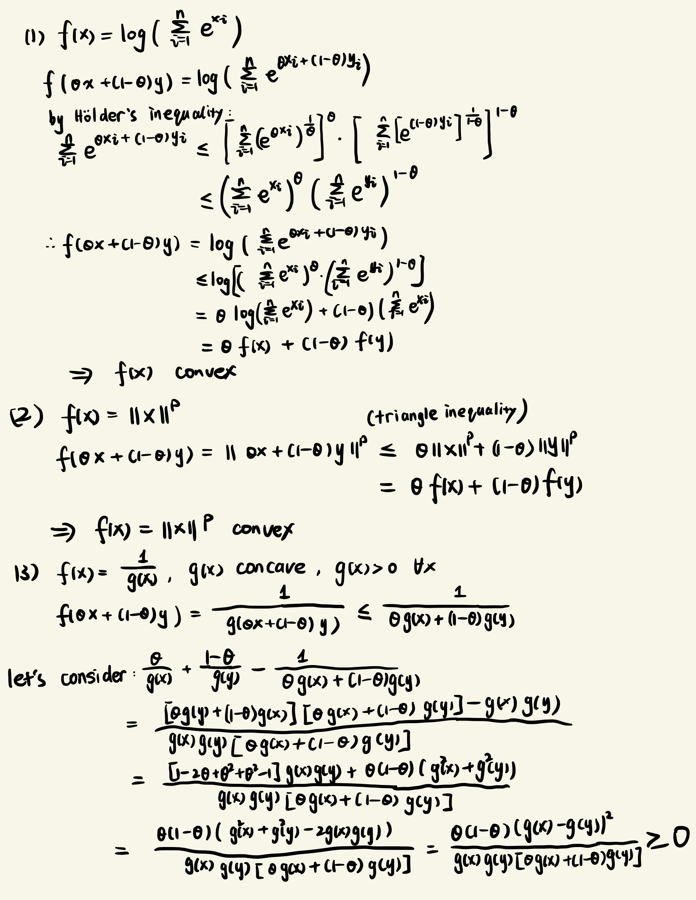
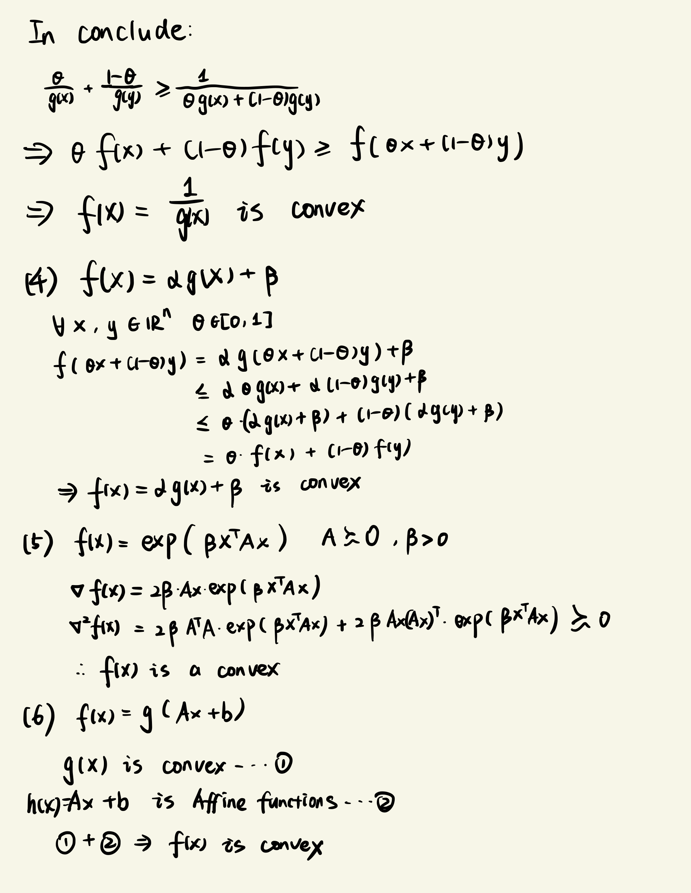
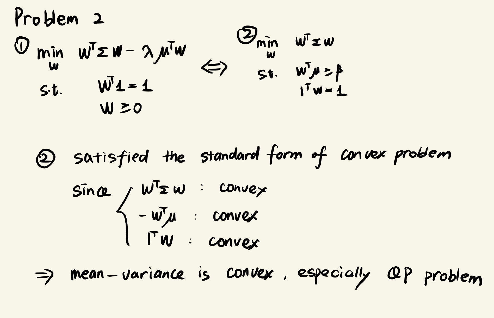

# Problem 1

{width="1600"}

{width="1600"}

# Problem 2

-   The following shows this problem is convex

{width="1600"}

-   The following calculate Markowitz's MVP with parameter lambda

```{r message=FALSE, warning=FALSE, paged.print=FALSE}
library(quadprog)
library(ggplot2)

# set global digits
options(digits=10)

# calcualte solution of Markowitz’s mean-variance portfolio
cal_solution <- function(Dmat,Amat,bvec,lamda){
    Expection <- c()
    Variance <- c()
    for(i in lamda){
        res <- solve.QP(
            Dmat,
            dvec = 2*mu*i,
            Amat,
            bvec
        )
        weight = res$solution
        Expection = cbind(Expection,t(mu)%*%weight)
        Variance = cbind(Variance,(t(weight)%*%Dmat%*%weight)^0.5)
    }
    res = data.frame(Risk = t(Variance), Return = t(Expection))
    return(res)
}

# lambdas defined by HW requirement
lamda_points <- c(0,10^-4,2*10^-4,3*10^-4,4*10^-4,5*10^-4,6*10^-4,7*10^-4,8*10^-4,9*10^-4,10^-3)

# lambdas to generate sufficient points to create smooth curve
lamda_curve <- 1:1000*10^-6

# define parameter for function defined above
mu <- c(0.001,0.05,0.005)
Dmat <- matrix(c(1.0,0.0015,-0.02,0.0015,1.0,-0.1,-0.02,-0.1,1),3,3)
Amat <- cbind(
    diag(rep(1,length(mu))),
    c(rep(1,length(mu))),
    c(rep(-1,length(mu)))
)
bvec = c(0,0,0,1,-1)

# using function defined above to calculate Markowitz's MVP 
efficient_points = cal_solution(Dmat,Amat,bvec,lamda= lamda_points)
efficient_curve = cal_solution(Dmat,Amat,bvec,lamda = lamda_curve)

# plot
ggplot() + 
    geom_point(
        data = efficient_points, 
        aes(Risk,Return),
        shape=18,
        color ="red"
    ) + 
    geom_line(
        stat="smooth",
        data = efficient_curve,
        aes(Risk,Return),
        se=F,
        alpha=0.3,
        color ="black"
    ) +
    labs(
        title = "Efficient Frontier"
    )
```
