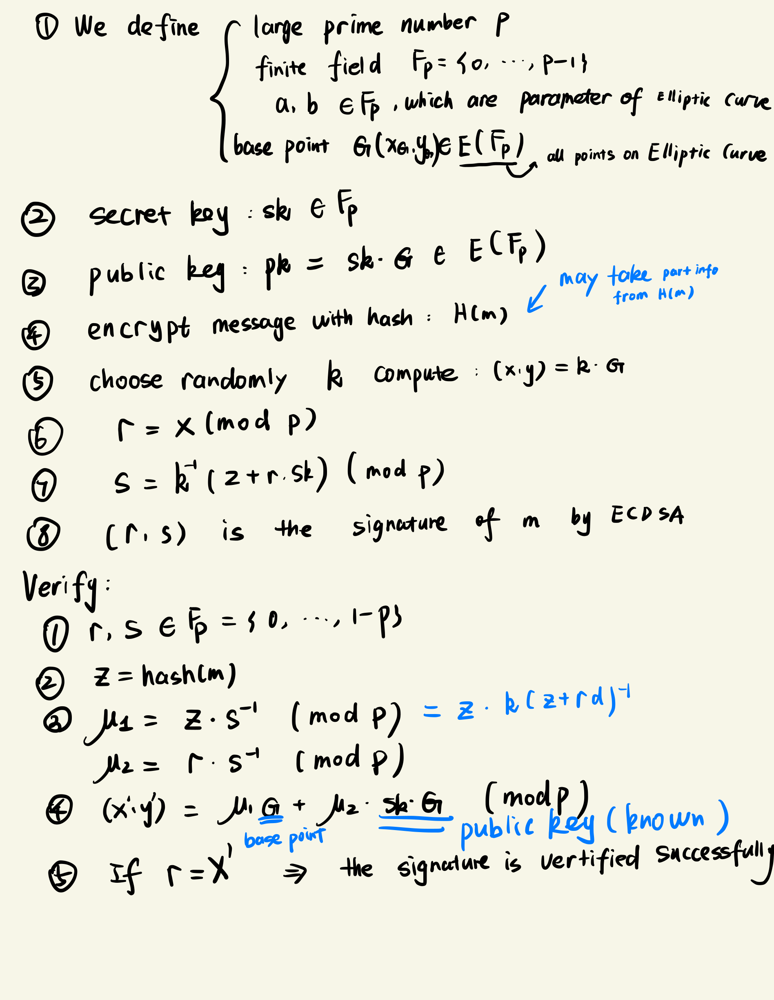
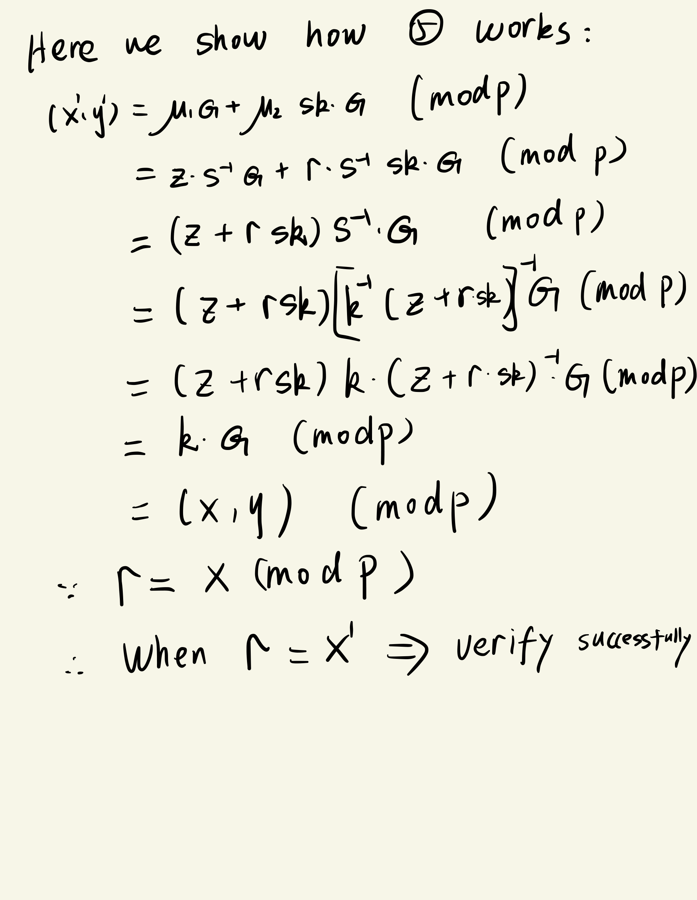
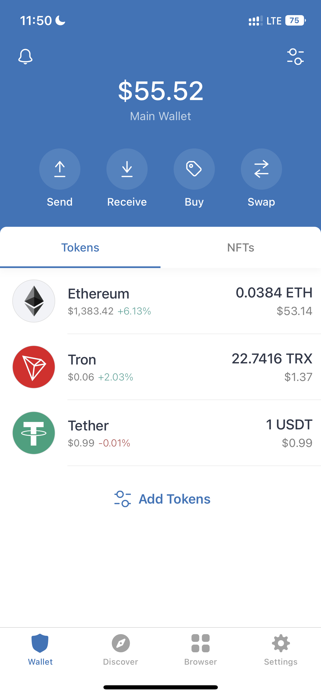
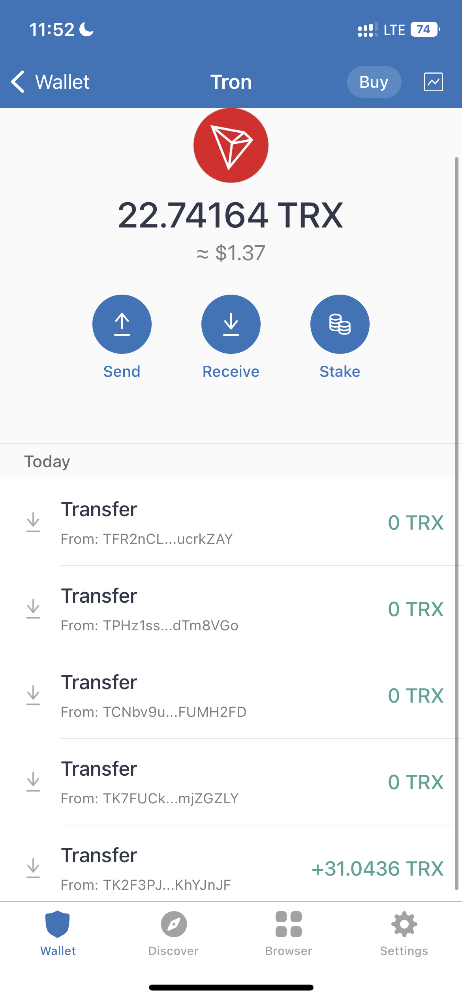

```{r setup, include=FALSE}
knitr::opts_chunk$set(echo = TRUE)
```

# Question1

**Write a program or go to the reference website to hash the phrase: "Hello, world!\*" with a number of appended to generate 4 leading "0"s. (e.g. Hello, world!0, Hello, world!1 )**

```{python}
import hashlib


def do_cal(string):
    md5 = hashlib.md5()
    md5.update(string.encode("utf-8"))
    return md5.hexdigest()


a = "Hello, world!"
b = ""
number = 1
while b[:4] != "0000":
    c = a + str(number)
    b = do_cal(c)
    number = number + 1
print("The string is: " + c + "\n" + "The hash value of string is: " + b)
```

# Question2

**Show the correctness of the verification model of ECDSA signature scheme.**





# Question3

**Experience Blockchain:**

-   **(1) Install a Crypto Wallet on your PC and/or mobile phone;**

-   **(2) Make some transactions (e.g. purchase something or exchange with a friend), and show the transaction record as proof;**

-   **(3) List three areas of improvement for the wallet software that you use**

{width="200"}

{width="200"}

Improvement for application named trust:

-   do not support USDT(TRC20) swap for other cryptos, when you want to transfer USDT(TRC20) you need to buy TRX to pay the transaction fee.

-   browser interface embedded is very simple, needs more fuctions

-   no chrome extension
